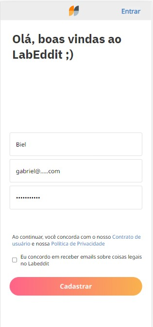
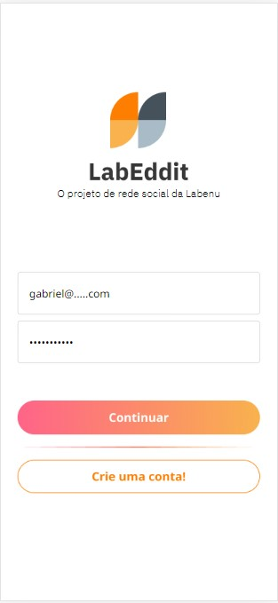
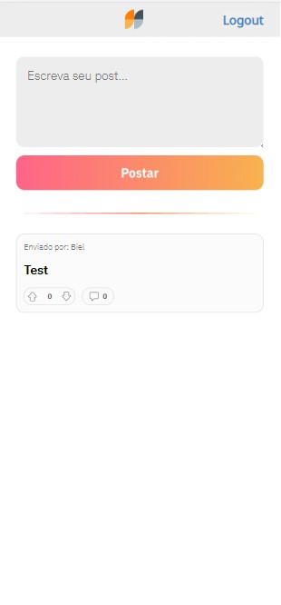
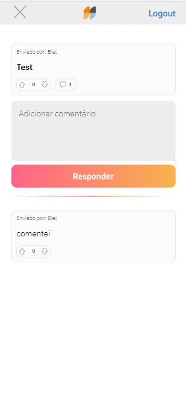

# Labeddit-Frontend


Esse é um projeto desenvolvido em dois repositórios. Neste repositório é possível encontrar toda estrutura de frontend do projeto, que se trata de uma rede social onde os usuários podem postar textos e reagia as postagens de outros usuários.
Projeto desnvolvido com foco em um design de app mobile first

## Indice
- <a href="#funcionalidades-do-projeto">Funcionalidades do projeto</a>
- <a href="#repositorio-do-back-end">Repositorio do Back-end</a>
- <a href="#layout">Layout</a>
- <a href="#demonstração">Demonstração</a>
- <a href="#como-rodar-o-projeto?">Como rodar o projeto?
- <a href="#tecnologias-utilizadas">Tecnologias utilizadas</a>
- <a href="#autor">Autor</a>

## Funcionalidades do projeto

- [x]Cadastrar um novo usuário
- [x]Login do usuario
- [x]Visualizar publicações
- [x]Criar publicações
- [x]Comentar publicações
- [x]Like em publicações e comentarios
- [x]Dislike em publicações e comentarios

## Repositorio do Back-end

o link abaixo irá direciona-lo para o repositorio que foi desenvolvido a API.

[Repositorio Back-end](https://github.com/gabrielsan179/Labeddit-backend)

## Layout

página para cadastrar-se



página para logar-



página para postar



página para comentar



## Demonstração
[Link demonstração](https://labeddit22022103.surge.sh/)

## Como rodar o projeto?

O progeto ja esta disponivel no link acima, mas se quer rodar o projeto localmente utilize os comandos no seu terminal 

```bash
#Clone este repositório
$ git clone linkdorepositorio

#Acesse a pasta do projeto no seu terminal
$ cd labeddit-frontend

#Instale as dependências
$ npm install

# Execute a aplicação
$ npm rum start

# A aplicação será iniciada na porta 3003, acesse pelo postman e poderá executar os endpoints
```

## Tecnologias utilizadas

1. [React](https://pt-br.reactjs.org/)
2. [React Router](https://reactrouter.com/en/main)
3. [Styled-Components](https://styled-components.com/)
4. [React Axios](https://www.devmedia.com.br/consumindo-uma-api-com-react-js-e-axios/42900)

## Autor


[Linkedin](linkedin.com/in/santos-s-gabriel)
